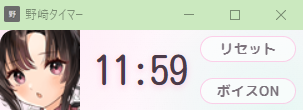

# 野崎タイマー

艦隊これくしょんの野崎によりCOND回復タイミングを管理するタイマーを表示します。

母港アクセス時に残り時間ボイス通知を行い、15分以上経過で自動リセットします。

---

## 仕様

通信内容は見ずにアクセスエンドポイントのみで母港判定を行うため非常に軽量動作します
- 母港通信時に15分経過している場合にタイマー自動リセット
- 編成画面の操作や野崎条件判定はしないので野崎を手動編成した場合はタイマーも手動リセットが必要

---

## インストール

### ダウンロード

1. このページ右上の **緑の「Code」ボタン** をクリック  
2. **「Download ZIP」** を選択  
3. ダウンロードしたZIPを解凍  

### Chromeへの読み込み

1. Chromeで `chrome://extensions/` を開く  
2. 右上の「デベロッパー モード」をオン  
3. インストール
  - 「パッケージ化されていない拡張機能を読み込む」  > 解凍したフォルダを選択 
  - またはフォルダをドラッグ
4. 拡張を再読み込み後、別窓が自動表示されます（閉じた場合は拡張アイコンで再表示）

---

## 使い方

- 初回: 野崎を旗艦 or 母港リセット時にタイミングを合わせて「リセット」で開始
- 野崎を編成した場合は都度「リセット」でタイマー開始/リセット
- 「ボイス ON/OFF」で音声通知の切替
- 閉じた場合は拡張アイコンで再表示

---

## 権利・免責

- 本拡張機能は**非公式**です。  
- ゲーム運営および権利者とは一切関係ありません。  
- 本拡張の利用は自己責任で行ってください。  
- 利用により生じた損害・トラブルについて作者は一切の責任を負いません。  
- ゲーム/サービスの利用規約に従ってご利用ください。
